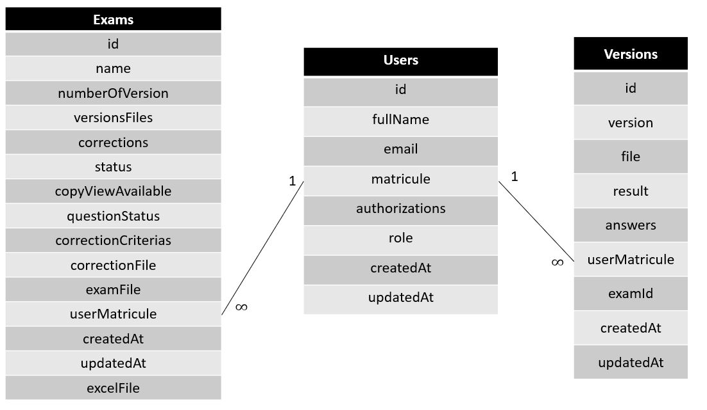
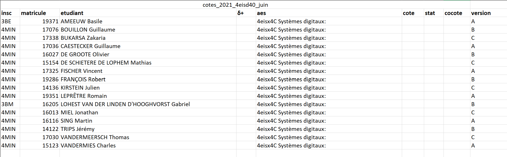

# KorreKthor <!-- omit in TOC -->

- [Usage](#usage)
- [Run for production](#run-for-production)
  - [Setting up](#setting-up)
    - [Dotenv file](#dotenv-file)
    - [SSL certificates](#ssl-certificates)
  - [Deployment](#deployment)
  - [Images](#images)
  - [Data](#data)
- [Database](#database)
  - [Set-up the database](#set-up-the-database)
  - [Access the database](#access-the-database)
- [Web interface](#web-interface)
  - [Install dependencies](#install-dependencies)
  - [Run Project](#run-project)
  - [Link with the database](#link-with-the-database)
    - [Updating the models table](#updating-the-models-table)
      - [With force](#with-force)
      - [With migrations](#with-migrations)
      - [Specific migration](#specific-migration)
  - [How to use the app](#how-to-use-the-app)
  - [Student list format](#student-list-format)
- [Python image processing](#python-image-processing)
  - [Setup](#setup)
  - [Run the pdf processing method](#run-the-pdf-processing-method)
  - [Accessing the zip file](#accessing-the-zip-file)
  - [Test](#test)
- [Code structure](#code-structure)
  - [Web Interface](#web-interface-1)
  - [Image Processing](#image-processing)
  - [Hardware](#hardware)

## Usage

For using KorreKthor web interface please watch those videos :

- [Create an exam](https://youtu.be/6foOI38oW10)
- [Upload copies](https://youtu.be/aUPqT1mtdQw)
- [View an exam copy](https://youtu.be/k0v1PA8TOX0)

For using the KorreKthor scanner please read the [user's manual](https://github.com/ThomasVandermeersch/KorreKthor/raw/main/Hardware/KorreKthor-Manuel_d_utilisation.docx).

## Run for production

### Setting up

First thing first, clone this github repo in `/` (for example). Then you have the code in `/KorreKthor/`
#### Dotenv file

Please consider creating a `.env` file in `/KorreKthor/Interface web/` folder with the database informations. The `.env` file must contains :
- NODE_ENV (equal to development or production)
- OAUTH_APP_ID (oauth config var)
- OAUTH_APP_SECRET (oauth config var)
- OAUTH_REDIRECT_URI (oauth config var)
- OAUTH_SCOPES (oauth config var)
- OAUTH_AUTHORITY (oauth config var)
- EMAIL_ADDRESS (For sending complain)
- EMAIL_PASSWORD (For sending complain)
- ENDPOINT (Your ip/url address to locate the server)
- SESSION_SECRET (Your secret token session)
- POSTGRES_PASSWORD
- POSTGRES_USER
- POSTGRES_DATABASE_prod (for production only)
- POSTGRES_HOST_prod (for production only, equal to db or localhost or remote postgres address)
- POSTGRES_PORT_prod (for production only)
- POSTGRES_DATABASE_dev (for development only)
- POSTGRES_HOST_dev (for development only)
- POSTGRES_PORT_dev (for development only)
- PYTHON_SERVER_HOST (equal to processing or localhost)
- PYTHON_SERVER_PORT
  
#### SSL certificates

If you don't have any certificates provided by a CA you can generate them yourself with openssl as follow :

```
$ openssl req -x509 -newkey rsa:4096 -keyout key.pem -out cert.pem -days 365
```

Place the key.perm and the cert.pem in a new folder located in `/KorreKthor/Interface web/certificates/`

### Deployment

You need to install docker and docker-compose. See this [link](https://docs.docker.com/get-docker/) for more informations about it.

Once docker installed, you need to run this command on a terminal in the root folder of the project (let's call it `/KorreKthor/`):
```
$ docker-compose --env-file ./Interface\ web/.env -f docker-compose.yml up
```

> Note: The database files are stored in `/data/db/data/`.

To stop the app don't forget to run:
```
$ docker-compose -f docker-compose.yml down
```

If you want to update some docker container after updating the code, run:
```
$ docker-compose --env-file ./Interface\ web/.env -f docker-compose.yml up --build
```

You're now able use the KorreKthor app. Open your favourite web browser and access https://localhost:9898  

### Images

The KorreKthor app runs on multiple docker images :

- postgres
- adminer
- node
- korrekthor_backend
- korrekthor_img_processing

### Data

You can access the docker data in the `/data` folder. The `db/` folder saves the database files and the `files/` folder saves the image processing files.

## Database
### Set-up the database

You can set up your own database without docker. To do so, you just need to install PostgreSQL and update the `.env` file with your database informations.
### Access the database
To access the database it's recommended to install [pgAdmin4](https://www.pgadmin.org/) (a browser for PostgreSQL database). 
But, if you don't have any database browser you can use the docker PostgreSQL built-in browser named [adminer](https://www.adminer.org/) and listening on port **1880**. 

The PostgreSQL server listen on the port you specified in the `.env` file with the user and password also specified. 

## Web interface

If you want to run the Web interface by your own (without docker) you can follow these steps in the `/KorreKthor/Interface web/` folder. 
### Install dependencies
````
$ npm install
````
### Run Project
Only if you're building the whole project, you need to apply the migations (create the different tables). To do so, run:
```
$ sequelize db:create
$ sequelize db:migrate
```
> Note: if an error occurred try `export NODE_ENV=development` before running the above commands.

Run :
````cmd
$ node app.js
````
or, if you want to automaticly reload the server when changes :
````cmd
$ npm run start
````
### Link with the database
The project use a ORM dependency named [sequelize](https://sequelize.org/). 

Here is the database working draft :



Well, for creating a instance of a User, you just  have to insert the following lines:
```js
const { User } = require("./node_scripts/database/models");

await User.create({"fullName":"Tom DELVAUX","email":"17098@domain.be" "matricule":"17098", "authorizations":0, "role":0})
```

Here are some example for querying the datas:

```js
var user = await User.create({"fullName":"Tom"})
var exam = await Exam.create({"name":"Exam 1", "numberOfVersion":4, "userId":user.id})
var copyA = await Copy.create({"version":"A", "userId":user.id, "examId":exam.id})
var copyB = await Copy.create({"version":"B", "userId":user.id, "examId":exam.id})

var examS = (await Exam.findAll())[0]
console.log(await examS.getUser())
console.log(await examS.getCopies())

var userS = (await User.findAll())[0]
console.log(await userS.getExams())
console.log(await userS.getCopies())

var copyS = (await Copy.findAll())[0]
console.log(await copyS.getUser())
console.log(await copyS.getExam())
```

#### Updating the models table
##### With force
When your model is updated you can just run this command to synchronize it with the database:

```
$ node node_scripts/database/migrations/migrate.js 
```
> Note: This is NOT for saving an instance in the database. This is for dropping all the tables and re-creating. All your datas will be lost !
##### With migrations
After updating your model, you juste need to update the migration file related to this model. 

Then, run:
```
$ sequelize db:migrate:undo // To undo the migration
$ sequelize db:migrate // To apply the new migration
```
> Note: if an error occurred try `export NODE_ENV=development` before running the migation(s)

##### Specific migration
For more specific migration, create a migration template with the command :
```
$ sequelize migration:generate --name MIGRATION_NAME
```

Then, ensure the generated file is located in the *migrations/* folder

Finally, run the migration :
```
$ sequelize db:migrate
```

> Note once the transaction finishes you can move the migration file to the *update_migrations* folder to ensure to not re-execute that migration. 

### How to use the app
First, open your favorite browser and enter this url : http://localhost:9898/.

Then, upload you student list and click **Submit file**.
> Note : this list must follow the [Student list format section](#student-list-format)

After, upload you different exam version and click **Submit all files**. 

For each version, select the correct answer(s) and click **Send**
> You can add or delete a question by clicking **Add Question** or **Remove Quesiton**
> 
> You can also click the **+** button to add an answer in a question

Wait a few seconds and your file is ready! Just click **Download**

### Student list format
The student list must contain at least 3 columns :
- *matricule* 
- *etudiant*
- *version*


Here is an example of student list :




## Python image processing

### Setup
To setup the python server you need to be in the `/KorreKthor/image_processing/` folder and then run:
```cmd
$ pip install -r requirements.txt
```
> Note : Using a virtual environement is a good practice.

Finally, run :
```cmd
export PYTHON_SERVER_PORT=8081 (optionnal)
$ python server.py
```

### Run the pdf processing method

You need to make a *POST* request to the python server you've configured in the `.env` file on the request route `http://your-ip:you-port/run`. With form-data as follows:
```json
{
  "my_file":UPLOAD_YOUR_FILE
}
```

The response is the form :
```json
{
    "zipFile": "78c170ae-8a10-4b1c-9d7f-d3e038141e68.zip",
    "data": [
        {
            "qrcode": {
                "matricule": 17076,
                "version": "B",
                "lessonId": "78c170ae-8a10-4b1c-9d7f-d3e038141e68"
            },
            "answers": [...],
            "file": "78c170ae-8a10-4b1c-9d7f-d3e038141e68_B_17076.png",
            "error": "None"
        },
        {
          "error" : "No answers scanned in From_PDF/78c170ae-8a10-4b1c-9d7f-d3e038141e68_C_14136.png"
        },
        {
          ...
        },
    ]
}
```

### Accessing the zip file 

The zip file is available on the python server you've configured in the `.env` file on the request route `http://your-ip:you-port/static/78c170ae-8a10-4b1c-9d7f-d3e038141e68.zip`

### Test 

For running tests run the following command in the *./image_processiong/* folder : 
```
$ python -m pytest tests
```
## Code structure

The code is splitted in 3 parts : the Web Interface, the Image Processing, and the Hardware. 

### Web Interface

Files are located in `/KorreKthor/Interface Web/`
- The main file to run is in `app.js`
- The embedded javascript files are in `/public/javascript/`
- The backend files are located in `/node_scripts/`
- The router files are located in `/routes/`
- The .pug view files are in  `/views/`

### Image Processing

Files are located in `/KorreKthor/image_processing/`

- The server file is `server.py` (Note: You need to specify PYTHON_SERVER_HOST and PYTHON_SERVER_PORT in order to run this file outside a docker container)
- The `main.py` file calls all the python scripts and make the request response
- The `process_img.py` file makes all the images processing scripts in order to return the decoded answers list
- The `process_pdf.py` file is used to extract all page to a .png file from the source pdf file
- The `source_pdf` folder contians the original patten images

### Hardware

Files are located in `/KorreKthor/Hardware/`

- The `Modèle_3D/` folder contains the 3D printing files: LEDS supports, camera support, raspberry case, … 
- `PI_funct.py`: File including the functions of moving the arm, taking pictures, operating the valve and the motor. 
- `selection.py`: Creating the movement sequence, taking pictures, and saving pictures 
- `booting.py`: allows you to operate the interface, LED brightness and start buttons. This file is to be run on the Raspberry Pi boot, allowing the user to use the physical interface without the need of any screen (to be added in “/etc/rc.local”). 
- The `PCB/` folder contains the pdf schemas and the Altium project
